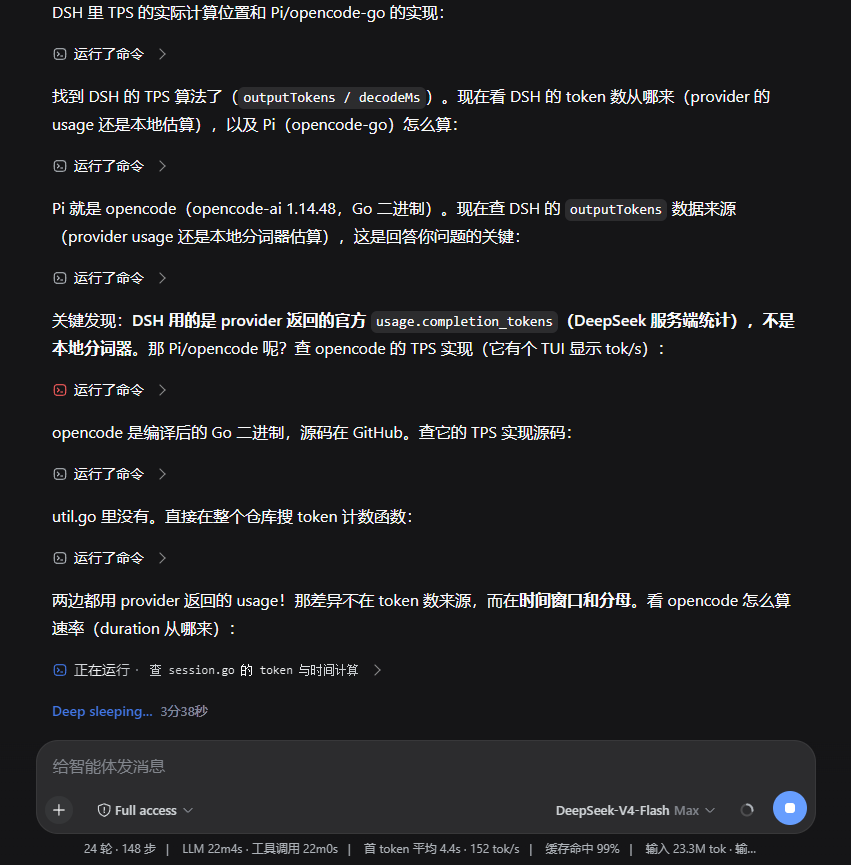

# dsh-auto-collapse

> DeepSeek Harness Web 客户端插件：把会话里的工具卡片与 Think 推理块自动折叠成一行摘要，让界面只保留模型说的话。增强版集成了回合级指标摘要栏（耗时 / token 用量 / tok/s 等，配置可控）。
>
> **核心原则：整个执行过程能分层级、量化地展示。** 模型正文之外的一切系统信息（思考 / 工具调用 / 上下文注入 / 重试等状态行）都按「类别 × 数量」折叠成可展开的行，进行中最新的活动保持可见。
>
> English: [README.en.md](./README.en.md)

## 这是什么

`dsh-auto-collapse` 是一个纯前端 DOM 插件，挂在 DeepSeek Harness Web 聊天界面上，把工作流程折叠成一行行摘要——工具调用、推理过程不再占据整屏，呈现接近 VSCode Codex 桌面端的折叠体验，**同时将“Deep diving” 修改为可配置的“Deep sleeping...”**。它不改动消息内容，只控制工作流程的显示状态。

## 效果预览



## 特性

- **回合完成自动收起**（一级）：每个回合完成后，工作过程收成一行 `已处理 X秒`，只留模型最终正文；点击展开完整工作流程（上下文注入 → 思考 → 工具调用 → 过程正文 → 最终正文）。
- **进行中实时摘要行**：回合进行中，工作流最顶端显示一条实时摘要行（`已工作 X秒 | 工具调用 / tokens…`），带运行呼吸点、耗时每秒走表，只实时统计、不打断流式输出；回合完成后由可点击的一级行接管。对齐 dsh-turn-fold 的 running summary。
- **二级折叠行**：展开一级后，工具调用组与思考块各自折叠成一行 chip（`正在运行 {命令}` / `运行了命令` / `编辑了文件` / `已思考` / `上下文注入`），点击展开/收起；相邻工具组合并，正文输出是硬边界（不会跨正文合并）。**正文之间不同类别的系统信息跨类别合并折叠**：think + 工具 + 上下文注入 + model-retry 等状态行合成一个 chip，chip 标注各自类别×数量（如 `2 段思考 · Bash ×2 · 2 次上下文注入 · 1 次重试`）。**仅相邻 ≥2 条非正文内容才折叠**：单条工具调用 / 单段思考 / 单条上下文注入保留原生行展示，不生成 chip。进行中的思考由原生 ReasoningRow 单独承载，chip 不再镜像「正在思考」与实时思考内容。
- **二级 chip 分层粒度计数**：完成态 chip 收起时展示各类别×数量（`N 段思考 · 工具名 ×次数 · N 次上下文注入 · N 次重试`，如 `Bash ×2 · Read ×1`），工具名按**数量降序**排列、并列保持首次出现顺序，有失败时追加浅红 `K 个失败`。对齐 dsh-turn-fold 的 activityGroup。
- **PTC（run_code）子工具名展示**：PTC 模式下单个 `Code` 卡内编排多个工具调用时，只要 dsh 系统解析出 1 个及以上具体工具名（`Code` 与子工具占 2 行+），就对其折叠；折叠行优先按解析出的子工具名 × 数量展示实际使用的工具（如 `Bash ×2 · Read ×1`），未获取到系统解析的实际工具名时才用 `Code` 兜底。
- **二级折叠末尾的工具调用说明（不限 Code）**：完成态二级折叠行末尾追加「最后一次工具调用」的说明——`Code` 的 description、`Bash` 的命令、`Read`/`Grep` 的路径等 summary 均尽量提取，后出现的工具覆盖先出现的；显示方式可在设置中配置为 始终显示 / 悬停显示 / 不显示，默认始终显示。
- **标准模式工具名解析**：工具名优先读 `data-tool`，回退 `data-sample`（bash 等 keyed toolview 的 bash-sample 样式没有 `data-tool`）；运行状态也从同一 root 读取。这样标准模式下 bash 工具调用不会被降级显示为 `Tool ×N`，running 中的 bash 行也不会被误判为完成态而折叠。
- **轮次折叠保留最后 N 条正文**：每个轮次折叠时，最后 `N` 条正文文本不收入轮次折叠、保留显示（含最终正文）——`N` 可在设置「轮次折叠保留正文条数」自定义，**默认 1**（即只保留最终正文，行为与旧版一致）；填 0 时除最后一个轮次外，其余轮次的全部正文（含最终正文）都折叠进轮次行，**最后一个轮次始终至少保留 1 条正文**。点击轮次行展开后仍可查看被折叠的正文。
- **进行中保持最新内容可见**：回合进行中时，二级 chip 保持收起，已完成行逐条折叠进 chip（chip 摘要追加已完成计数 + running 命令）；同时最后 `N` 个系统提示行（思考 / 工具 / 上下文等非模型输出内容）保留完整显示、不收入折叠——`N` 可在设置「进行中保留行数」自定义，**默认 3**（填 0 表示不保留任何系统行，含正在 running 的行全部折叠）。running→ok 的瞬时状态切换也不会把最新的那条命令/思考提前折进 chip，回合闭合后全部回到默认收起。**无被折叠行时不显示折叠行**：被保留规则全部覆盖、实际没有任何行被折叠时，不再出现「正在运行」等空 chip（running 行本身原生可见，无需 chip 兼作状态头）。工具行后紧接的「正在思考」单独成块，上方已完成工具块的 chip 不会被带成「正在思考」而两行同时刷新。
- **原生「对话显示」compact 模式协同**：DSH 0.1.2-alpha.3+ 的 设置 → 对话显示 开启 Compact（默认）后，DSH 用原生 disclosure 行（`turn-process`，显示「N 次工具调用 · M 条消息」）折叠已完成回合的过程内容。本插件检测到该回合的原生行后**不再创建自己的「已处理」一级行、不做一级隐藏**（两套折叠机制不打架，原生展开后行也不会被本插件的 display:none 卡死），改为把可配置指标摘要（耗时 / tokens / 命中率等）挂进原生 disclosure 行；关闭原生折叠（Normal）后自动回到本插件的一级折叠 + 指标行。
- **三级思考合并**：展开 `已思考` 后，连续思考合并为一个三级思考行（标题 `Think · 第一句`），点击展开合并内容块；原始四级行不出现。
- **原生视觉对齐**：图标盒 16px / glyph 14px / 行高 24px / 行距 16px，颜色使用 DSH 原生 token（`--dsw-alias-label-*`），思考与命令图标取自 DSH 原生图标（`IconThinkOutline14` / `IconApiOutline14`）。
- **展开/收起过渡动画**：点击驱动的展开（淡入 + 4px 上移，合并思考正文带高度展开）与收起（镜像淡出，后代随祖先 seat 整体消失、无跳变）均为 180ms；仅用户点击触发动画，流式协调器决策保持瞬时。
- **流式友好**：同一个 `assistant-step` 原地补正文、React 换节点和历史乱序挂载都会重新协调；running 状态带文字平滑呼吸动画，`prefers-reduced-motion` 下停止动画（过渡动画同样禁用）。
- **完整工作类型**：除 tool-call 外，顶层 `command` / `manual-compaction`、context 和纯图片 final 都按同一回合语义处理。
- **回合级状态行折叠**：DSH 原生的重试/失败/超限状态行（"已重试模型请求"、终态失败"出错了"、"已达到输出 token 上限"）随段折叠隐藏；落在工具组之间或工具组上一行的吸收进该二级 chip 一起折叠，被正文隔开的只随一级折叠。
- **异常终止也折叠**：回合被手动停止或异常中断、却没有正常 `turn-tail` 边界时（已停止的 tool 行 / 终态失败 / 输出上限），同样生成一级行折叠工作过程，停止态追加"已停止"标签。
- **可配置状态提示词**：在 设置 → 插件 → 插件配置 中可以编辑“状态提示词”，默认 `Deep sleeping...`；留空保存后恢复官方 `Deep diving...`。
- **可配置工具调用说明显示**：在 设置 → 插件 → 插件配置 的“工具调用说明”中选择完成态二级折叠行末尾「最后一次工具调用说明」的显示方式——`始终显示`（默认）/ `悬停时显示` / `不显示`，缓解折叠行说明文字与正文密集、信息过载。
- **回合级指标摘要栏**：回合完成后摘要行显示可配置的指标（耗时、工具调用次数、模型调用次数、输入/输出/推理 tokens、缓存命中/写入 tokens、缓存命中率、tok/s、首 token 用时），数据通过 shadow 渲染器从 React 会话快照直接获取并**按记录复现**（耗时用 `turnTimings`；token 在 0.1.2-rc.1 用 `turn-tail.data.tokenUsage`、旧版用 `node.data.usage` 回退；首 token 用时在 rc.1 直接读 `turn-tail.data.ttftMs`），精确可靠、不依赖实时结果。**输入 token = 本回合总输入（含缓存命中）**：优先取内置精确总量 `totalTokens − outputTokens`（与 DSH 原生统计同源；缓存桶缺失时三桶求和会漏掉缓存命中部分），精确总量缺失时回退 未缓存输入 + 缓存读 + 缓存写。
- **可配置指标字段**：在 设置 → 插件 → 插件配置 的"摘要栏指标"输入框中，用逗号分隔字段名控制显示哪些指标；默认显示 耗时 / 次模型 / 次工具 / 输入 / 缓存命中 / 命中率 / 输出 / 上下文增量。每个字段名后可用 `(自定义名)` 覆盖显示名，如 `inputTokens(输入上下文)`；写空括号 `()` 表示只显示值、不显示任何文字，如 `contextDelta()`。可选字段含 `contextDelta`（本轮新增上下文 = 本回合最后一次模型调用的输入 token − 上一回合最后一次模型调用的输入 token，取末次 attempt 的真实上下文规模、非跨重试求和；首回合基线取 0，即等于本轮末输入）。`tokensPerSecond`（输出速度）保留整数（四舍五入）。
- **中断安全按轮次匹配**：指标按 `sessionId:turn:segOrdinal` 从注入器模块级存储精确读取（main↔subagent 各会话隔离，不会同名 turn 串扰；插话切分同回合多段时各段独立统计），而非 DOM 位置就近匹配；turn 归属优先 turn-tail 原生 `data-turn-tail`。手动停止→发送新消息、执行中插话、切换会话，各轮次统计互不串扰、进行中计时不归零。
- **状态标签**：回合被停止或中断时摘要栏追加"已停止"/"已中断"标签。
- **交互感知**：键盘焦点或文本选择位于回合活动内容中时保持展开。
- **一键展开/收起全部二级折叠**：`Shift + 点击一级行` 展开该回合全部二级（再次 Shift+点击收起该回合全部二级）；`Ctrl/Cmd + Shift + E` 全局展开/收起所有一级 + 二级。不新增 UI，靠修饰键 + 快捷键。
- **状态持久化**：展开/收起状态通过 localStorage 持久化。
- **无障碍 ARIA 标签**：折叠行和 chip 均带 `aria-expanded` / `aria-label`。
- **双语支持**：根据 DSH Web 语言设置自动切换中英文摘要文案。
- **不依赖 dsh-harmony**：纯客户端插件，使用 DSH 原生 `slots.register` shadow 机制获取 React 数据。
- **可逆**：卸载（HMR stop）时完整还原所有折叠/隐藏/改写。

## 安装

已发布 npm 包（推荐，使用构建好的版本）：

```bash
dsh plugin --profile web add "dsh-auto-collapse"
```

从 GitHub 安装（开发版或需要跟随 `main` 分支时）：

```bash
dsh plugin --profile web add "github:a179-sanae/dsh-auto-collapse#main"
```

安装后重启 DSH web 服务（或触发插件 HMR），页面 `Ctrl+Shift+R` 硬刷新即可生效。无需任何配置。

**插件启停热生效**：本插件自带 roster 看门狗（node 侧 `/dsh-auto-collapse/roster` 探针 + 浏览器侧 1.5s 轮询）。

- **禁用任意客户端插件**：热生效——持有本 bundle 的已打开页面会在约 1.5–3s 内自动刷新并移除该插件的 UI，不需要重启 dsh web 服务，也不需要手动刷新。
- **重新启用本插件**：只有仍持有旧 bundle（禁用后尚未自动刷新的窗口期）的页面会自动恢复；已按禁用刷新过的页面不再装载本 bundle，需手动刷新一次。
- 3s 防风暴窗口内连续切换多个插件时，重载按 ≥3s 间隔排队收敛到最新状态（最多 3s 一次自动刷新，最终状态与最后一次切换一致）。

DSH 服务端本身对启停就是热生效的（watchUserPatches + dsh-client-modules 模块图重构），本机制补上的是浏览器侧的最后一步。

**代码更新无需重启服务**：更新本插件不需要重启 dsh web 服务——client half（`lib/client.js`）`npm run build` 后替换 `node_modules/dsh-auto-collapse/lib/client.js`（或 `dsh plugin --profile web update dsh-auto-collapse` 重新安装），由 DSH 官方 `dsh-client-hmr` 把 bundle 内容变化（rebuilt 帧）热替换到已打开页面（未启用 HMR 时 `Ctrl+Shift+R` 硬刷新即可）；host half（`lib/index.js`）改动由 DSH 服务端 `cordis-plugin-hmr` + `watchUserPatches` 热应用。仅当 host half 出现纯 JS 语法错误（DSH 加载 .js 不做类型剥离）导致插件树加载失败时，才需要修复后重启——`npm run build` 内置的 `node --check` 守卫会在构建期拦截此类回归。

## 兼容性

- 同时兼容 DSH 旧版（0.1.1-rc.x）、0.1.2-alpha.x 与 0.1.2-rc.1。host half 不静态 import `@deepseek-ai/dsh-settings` 里已被新版移除的 `settingsNamespace` / `installSettingsSection`，改为在运行时通过 `settings` 服务按能力选择：新版走 `settings.installSection()`，旧版用 `settings.register()` 复刻旧语义。
- 0.1.2-rc.1 适配：回合 token 权威源迁到 `turn-tail.data.tokenUsage`（`uncachedInputTokens`，cache/reasoning 可选），`assistant-step.data.usage`（类型 `unknown`）仅作回退；`nodes` 从 `Map` 变为 `ChatNodeStore` 接口（仅用 `.get()`）；`connection.hostDescription` 已移除，shadow entry 不再声明 inject 面；locale NS 跟随内置 entry（rc.1 为 `chat`，旧版为 `conversation`）。
- 指标读取按快照形状自适应（tokenUsage 优先、usage 回退），不依赖版本字符串分支，同一份构建产物在升级前后的 DSH 上都能启用。
- 客户端依赖清单 `dsh.client.inject` 同时保留旧版 `@deepseek-ai/dsh-client-runtime` 与新版 `@deepseek-ai/dsh-client-ui-renderer`（`slots` 服务的新提供方）；清单中当前版本不存在的条目会被 client-modules 静默跳过，不影响加载。
- rc.1 默认「对话显示」Compact 模式下，`Shift+点击` 原生 disclosure 行（即轮次指标行）同样可一键展开/收起所有折叠项；`Ctrl/Cmd+Shift+E` 快捷键也同时驱动原生行。

## 开发

### 项目结构

```
src/fold.ts          核心：FoldController（状态机）+ findBlocks（块识别）+ 折叠/展开逻辑 + 指标提取
src/turn-metrics.ts  回合指标注入器：shadow 渲染器从 React 会话快照获取 token 用量/耗时/tok/s
src/client.ts        浏览器端入口（注册插件 + 指标注入器 + roster 看门狗）
src/roster-watch.ts  插件启停热生效看门狗（轮询 node 侧探针，roster 变化自动重载页面）
src/settings.ts      插件配置卡片（状态提示词 + 摘要栏指标配置）
src/locales.ts       中英文双语支持
src/index.ts         host half
build.mjs         esbuild 构建（lib/client.js 的注册 id 在 banner 里）
deploy.mjs        安全部署：校验 → 备份 → 替换 → 身份核验重启 → 哈希验证/回滚（DSH web 输出持久化到 ~/.dsh/logs/web.{out,err}.log）
cordis.patch.yml  profile 树挂载
test/             fake DOM 契约、竞态、会话切换与 40 组乱序排列回归
```

### 检查

```bash
npm run check
```

依次执行 TypeScript 检查、构建和全部回归测试。

### 快速部署（本机开发）

```bash
npm run deploy
```

脚本先核验插件/DSH 包名和 3080 监听进程身份，再做时间戳备份、替换、重启与服务端哈希验证；失败自动恢复旧 bundle。可用 `DSH_AUTO_COLLAPSE_LIB`、`DSH_DIR`、`DSH_WEB_PORT`、`DSH_LOG_DIR` 覆盖默认路径。

### 发布新版本

更新 `package.json` 中的 `version` 后，发布到 npm（`prepack` 钩子会自动构建）：

```bash
npm publish --access public
```

本机开发也可以只打包为 tgz：

```bash
npm pack --pack-destination <本地插件目录>
```

将 profile 的 `package.json` 中插件依赖更新为新 tgz 路径后重新安装插件。

### 关键机制

- **块识别**（`findBlocks`）：顶层节点按 tool-call、command/manual-compaction、context、thinking 和正文分类；user/steering/turn-tail 是不可跨越的硬边界。
- **segment 协调**：每轮根据当前 DOM 顺序重建 segment；最后一个含文本或媒体的 `assistant-step` 是 final，其余正文是中间过程。稳定 flow/key 复用展开状态，不依赖一次性 mutation 事件。
- **时长**：流式回合按 segment 分别记录 running 起点；历史回合从官方时长或 `timeStart`/turn-tail 解析。格式 `X秒` / `X分Y秒`，整分省略秒位。
- **React 共存与可逆性**：节点替换后按稳定 key 重新绑定；一级行被移除会按原展开状态重建；所有 inline `display` 在首次改写前保存并精确恢复。
- **插件启停热生效**：node half 暴露 `/dsh-auto-collapse/roster` 探针（可选注入 webServer，只返回 clientModules 模块图 id 集合的签名与自身是否在列，避免 LAN 无鉴权枚举插件清单）；浏览器 half 每 1.5s 轮询对比基线，签名变化（任意客户端插件启停）或自身路由 404 时带缓存穿透参数自动重载页面；sessionStorage 时间戳 + 3s 最小间隔防重载风暴。插件被禁用后旧页面会在 ~3s 内刷新并移除折叠效果；重新启用本插件时，仍持有旧 bundle 的页面自动恢复，其余页面手动刷新一次。

## 许可

MIT
